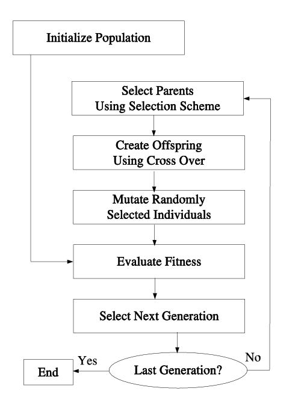

```@meta
CurrentModule = Julia4ML_GA
```

# Julia4ML_GA

[Julia4ML_GA](https://github.com/THB-account/Julia4ML_GA.jl) is a package for genetic algorithms.

## What is a genetic algorithm

[Genetic algorithms](https://en.wikipedia.org/wiki/Genetic_algorithm) solve optimization problems by
- creating a *population* of candidate solutions, each with their own *genomes*
- evaluating them with a *fitness function* and iteratively selecting only the best candidates
- maintaining the population size by creating new *populants* via *crossover* between successful populants
- *mutating* populants in random places of their genome



## Basic example


    using Julia4ML_GA
    
    # Easiest Usage Example: Solve a predefined example
    # rosenbrock takes to arguments (a, b). Solution at (a, a^2)
    best_solution = Julia4ML_GA.solve_rosenbrock(4, 100)
    println(best_solution) # Should print roughly the following vector: [4, 16] 

    # More elaborate Example: Define Fitness function and select appropriate genetic methods
    # starting population initialized with zeros
    starting_population = [[0.0, 0.0] for i in 1:100]

    # rosenbrock function as the fitness function. Solution at (1, 1)
    fitness_function = x->(1-x[1])^2 +100*(x[2]-x[1]^2)^2
    
    # setting population size manually (default is 50), needs to be the same size as starting_population
    ga_instance = Julia4ML_GA.GeneticAlgorithm(populationSize=100, 
            selection=roulette_wheel_inv,
            mutation=gaussian_displacement,
            crossover=k_point)

    # 1000 iterations containing crossover, mutation, evaluation, and selection to be performed
    iterations=1000

    # Execute optimization process
    result = Julia4ML_GA.optimize(starting_population,fitness_function,ga_instance;iterations)

    println(Julia4ML_GA.argmin(result)) # Should print roughly the vector: [1, 1]

    

