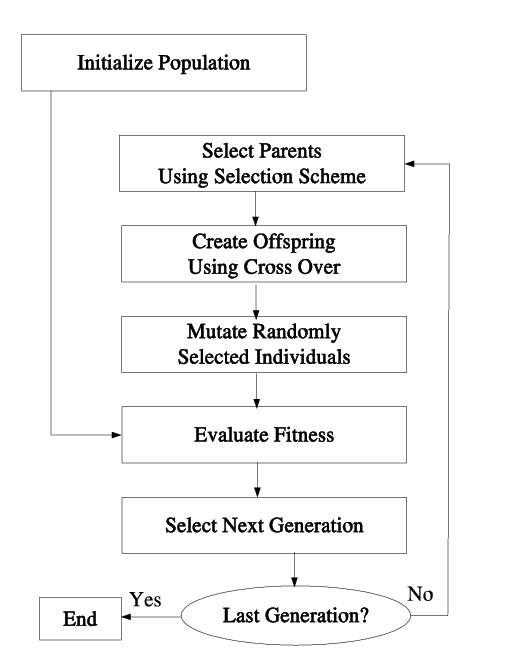
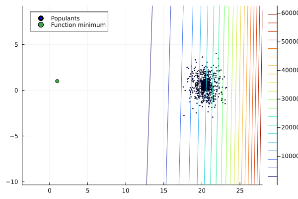
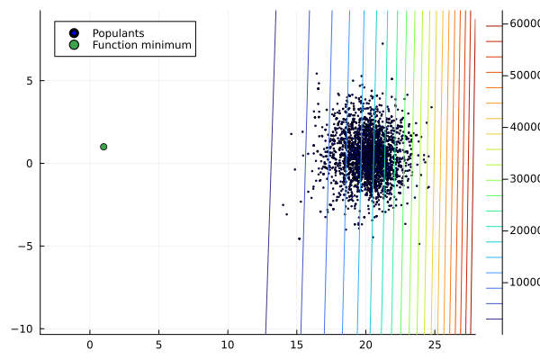
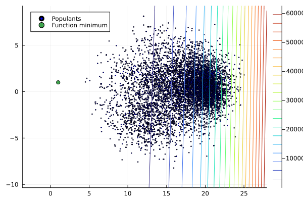
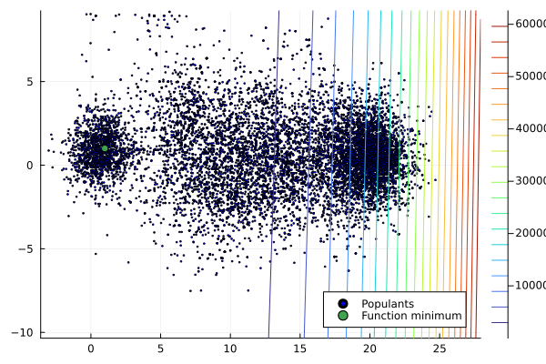

```@meta
CurrentModule = Julia4ML_GA
```

# Julia4ML_GA

[Julia4ML_GA](https://github.com/THB-account/Julia4ML_GA.jl) is a package for genetic algorithms.

## Disclaimer

This project was developed as part of a course at the TU Berlin. It will not be further developed after the end of the course. More information about licensing [here](https://github.com/THB-account/.Julia4ML_GA?tab=MIT-1-ov-file). 

## What is a genetic algorithm

[Genetic algorithms](https://en.wikipedia.org/wiki/Genetic_algorithm) solve optimization problems by
- creating a *population* of candidate solutions, each with their own *genomes*
- evaluating them with a *fitness function* and iteratively selecting only the best candidates
- maintaining the population size by creating new *populants* via *crossover* between successful populants
- *mutating* populants in random places of their genome



## Basic example

A few [examples are predefined and part of the package](@ref Examples), here an example using the [Rosenbrock function (Wikipedia)](https://en.wikipedia.org/wiki/Rosenbrock_function):

```julia
using Julia4ML_GA

# Easiest Usage Example: Solve a predefined example
# rosenbrock takes to arguments (a, b). Solution at (a, a^2)
best_solution = Julia4ML_GA.solve_rosenbrock(4, 100)
println(best_solution) # Should print roughly the following vector: [4, 16] 
```

## Example using the 'optimize' function

A more elaborate example using the more general [optimize function](@ref Julia4ML_GA.optimize):

```julia
using Julia4ML_GA

# Define Fitness function and select appropriate genetic methods
# starting population initialized purposfully with values that give a nice visualisation
starting_population = [[20.0, 0.0] for i in 1:100]

# rosenbrock function as the fitness function. Solution at (1, 1)
fitness_function(x) = (1-x[1])^2 +100*(x[2]-x[1]^2)^2


# setting population size manually (default is 50), needs to be the same size as starting_population
ga_instance = Julia4ML_GA.GeneticAlgorithm(populationSize=100, 
        selection=roulette_wheel_inv,
        mutation=gaussian_displacement,
        crossover=k_point)

# upper bound for iterations containing crossover, mutation, evaluation, and selection to be performed
iterations=1000

# lower bound for fitness value -> when is a solution good enough?
bound = 0.1

# Execute optimization process and return OptimizationResult instance
result = Julia4ML_GA.optimize(
            starting_population,
            rbf,
            ga_instance;
            obj_bound=bound, 
	    iterations=iterations,
	    trace_optimization=true # set to explore each iterations populants
        )
```

Here you can see for the above exmaple how the optimisation process may converge to the optimum.
Note that the process is randomized and my return different results.


```@raw html
<div style="display: flex; flex-wrap: wrap; gap: 10px;">
  <div style="flex: 1 1 auto; max-width: 45%; margin: 10px;">
    
    <figcaption> 1 iteration</figcaption>
  </div>
  <div style="flex: 1 1 auto; max-width: 45%; margin: 10px;">
    
    <figcaption> 4 iterations</figcaption>
  </div>
  <div style="flex: 1 1 auto; max-width: 45%; margin: 10px;">
    
    <figcaption> 11 iterations</figcaption>
  </div>
  <div style="flex: 1 1 auto; max-width: 45%; margin: 10px;">
    
    <figcaption> 15 iterations: Lower bound reached!</figcaption>
  </div>
</div>
```